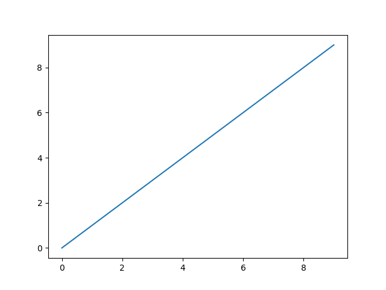

# CXBQN

VM for [BQN](https://mlochbaum.github.io/BQN/).

See [CONTRIBUTING.md](./CONTRIBUTING.md) for information on contributing.

## Building

Requires a compiler capable of C++20.
GCC 9.3.1 is the oldest compiler I have tested it with.

```console
mkdir build
cd build
# Use CXX to choose your compiler
CXX=g++-11 cmake ..
make -j12
./BQN -v
CXBQN 0.11.0 compiled on Dec 25 2021
```

## Using

```
$ ./BQN -h
Usage: BQN [options] args

Positional arguments:
args                   	all remaining arguments are passed into the BQN program as •args [default: {}]

Optional arguments:
-h --help              	shows help message and exits [default: false]
-e --execute           	execute a string as BQN code
-v --version           	prints version information and exits [default: false]
-p --execute-and-print 	execute a string as BQN code, pretty print the result
-x --dump-cu           	dump compilation units after compiling [default: false]
-r --repl              	enter REPL [default: false]
-f --file              	execute a string as BQN code
$ ./BQN -e '•Show 5+5'
10
$ ./BQN -p ↕10
⟨ 0 1 2 3 4 5 6 7 8 9 ⟩
$ ./BQN
   foo←5
5
$ echo '•Show 3‿3⥊↕9' > foo.bqn && ./BQN -f foo.bqn
┌─
╵ 0 1 2
  3 4 5
  6 7 8
        ┘
```

See the values of `•listSys` to see what system functions are available in your build of CXBQN.

The REPL also has Readline support if you enable that option at configure time.
When you run cmake, pass the argument `-DCXBQN_READLINE=ON` like so:
```console
mkdir build && cd build
cmake .. -DCXBQN_READLINE=ON
```

If you have a readline library and development headers installed, this will use
them and provide a much nicer REPL environment with variable name completion
like so:

```
$ ./BQN -r
   foo←5
5
   foobar←10
10
   # Tab once for attempted completion
   fo<TAB>
   foo

   # Tab twice for all options if there is no single completion available
   foo<TAB><TAB>
foo     foobar
   foo
```

## Configuring Options

|     CMake Option     |                                                                          Notes                                                                          |
|:--------------------:|:-------------------------------------------------------------------------------------------------------------------------------------------------------:|
| `CXBQN_READLINE`     | Enable Readline support in the BQN repl (recommended)                                                                                                   |
| `CXBQN_MEM_STRATEGY` | Possible values include "shared_ptr", "leak", and "gc". "gc" has not been implemented yet. For best performance, select "leak"                          |
| `CXBQN_BUILD_TESTS`  | Build test suite. Builds take much longer.                                                                                                              |
| `CXBQN_LOG`          | Enable logging. You will have to set the log level above `level::off` to get output. See log file `cxbqn-debug.log` after running BQN or a test runner. |
| `CXBQN_LOGLEVEL`     | Wrapper around spdlog's log levels. `level::debug` will produce an extremely large amount of data (~10-15gib for executing "2+2").                      |
| `CXBQN_DEBUG_VM`     | Output VM debugging information, including the opcode being executed, the program counter, and any opcode arguments.                                    |
| `CXBQN_DEEPCHECKS`   | Enable deeper checks which may produce more helpful errors but will hurt performance.                                                                   |
| `CXBQN_CUDA`         | Enable CUDA execution via `•_CUDAFor`                                                                                                                   |
| `CXBQN_FFI`          | Enable loading dynamic libraries and calling user functions from them.                                                                                  |
| `CXBQN_NATIVE_R0`    | Enable native C++ implementation of some runtime functions from r0.                                                                                     |
| `CXBQN_NATIVE_R1`    | Enable native C++ implementation of some runtime functions from r1.                                                                                     |
| `CXBQN_PLOT`    | Enable matplotlib bindings and the namespace `•cxbqn.plot`. See [`doc/plot.md`](doc/plot.md) for more information.                                                                                     |

## Specification Feature Support

| Spec Item          | Compliance      | Notes                                                                                                                                        |
|--------------------|-----------------|----------------------------------------------------------------------------------------------------------------------------------------------|
| Bytecode           | Full            |                                                                                                                                              |
| Runtime            | BQN-native and r0 | Almost all of r0 has a native implementation. We plan to replace elements of r1 with native functions as well                                                                                 |
| System Functions   | Partial         | See `•listsys` for the supported system values. Good candidate for first contribution.                                                       |
| Namespaces         | Partial         | Using fields of a namespace and destructuring without aliasing work, however mutable namespace fields are not supported. System-provided namespace `•file` has support for `•file.List` and `•file.Lines`.                    |

## Nonstandard Extensions

### GPU Execution

To build with CUDA, enable the CMake option `CXBQN_CUDA` at configure time.
Support for CUDA execution is limited, but it exists!
The primary function for CUDA execution is `•_CUDAFor`, which is a 1-modifier
that performs the primitive `𝕗` on array `𝕩` and optionally `𝕨`.
If you give this functionality a try, feel free to open an issue for any bugs you encounter (there will be many).
Here's an example:

```console
$ cmake .. -DCXBQN_CUDA=ON
$ make -j 12
$ ./BQN -r
   (↕10) × •_CUDAFor ⌽↕10
⟨ 0 8 14 18 20 20 18 14 8 0 ⟩
   10 + •_CUDAFor ↕15
⟨ 10 11 12 13 14 15 16 17 18 19 20 21 22 23 24 ⟩
```

[See the WIP design document for parallel execution here](./doc/GPU.md).

<!--
|      Extension     | Completion |                                                                     Notes                                                                    |
|:------------------:|:----------:|:--------------------------------------------------------------------------------------------------------------------------------------------:|
| GPU Execution      | Partial       | Plan to add support for primitive operations on data values (chars, numbers, strings, and arrays of any of these) on GPUs in the near future |
| Threaded Execution | None       | Same plan as above. Needs more discussion                                                                                                    |
| Libraries and Packaging | None       | There has been much discussion on this topic in the Matrix server, but little consensus has been reached. The first library-related feature CXBQN will support will likely look like `strings←•Import "←strings.bqn"` where `strings.bqn` is the strings library from Marshall's [bqn-libs repository](https://github.com/mlochbaum/bqn-libs). This will likely become a *standard library* of sorts, once consensus is reached. The first character of the string argument passed to `•Import` will have some special meaning indicating that the BQN VM ought to look in some special location (eg all directories in the environment variable `$BQNPATH`) or perform some operation before importing the specified library. |
-->

### Plotting

CXBQN supports bindings to matplotlib via [the matplotlib-cpp](https://github.com/lava/matplotlib-cpp) library.
To enable plotting, enable the CMake option `CXBQN_PLOT`.
You must have Python, matplotlib, and numpy installed.

[See `doc/plot.md` for more information.](doc/plot.md)

```console
BQN -e '•cxbqn.plot.Plot ↕10⋄•cxbqn.plot.Show@'
```


### FFI

[See the documentation for FFI here.](doc/FFI.md)

### Libraries and Packaging

There has been discussion on this topic on the Matrix server, but no consensus has been reached.
CXBQN supports importing from locations defined in the environment variable `BQNPATH`, a `:`-delimited path just like `$PATH`.

The order in which `•Import` searches for files is:

1. Current working directory
1. The `BQNPATH` environment variable (`:` delimited)
1. `<prefix>/share/bqn` where `<prefix>` is the installation prefix of CXBQN
1. `/usr/share/bqn`

<!--
The first character of the string argument passed to `•Import` will have some special meaning indicating that the BQN VM ought to look in some special location (eg all directories in the environment variable `$BQNPATH`) or perform some operation before importing the specified library.
-->

### Custom Namespace `•cxbqn`

Everything under the namespace `•cxbqn` is specific to the CXBQN implementation of BQN.
As of v0.10.4, only the value `•cxbqn.config` is available under this namespace:

```console
$ ./BQN -p '•cxbqn.config'
⟨ ⟨ "CXBQN_READLINE" 1 ⟩ ⟨ "CXBQN_CUDA" 0 ⟩ ⟨ "CXBQN_FFI" 0 ⟩ ⟨ "CXBQN_PLOT" 0 ⟩ ⟩
```
