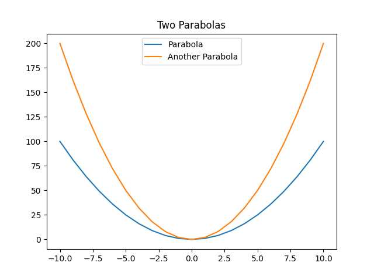

## Plotting with CXBQN

To enable plotting, you must have Python, matplotlib, and numpy installed, and you must enable the CMake option `CXBQN_PLOT` at configure-time.
All plotting utilites live under the namespace `•cxbqn.plot`.
The plotting API is modelled after matplotlib as `•cxbqn.plot` is simply a wrapper around it.
All of the plotting utilities are subject to change.
You may view all of the available plotting utilities by printing out the plotting namespace:

```
$ ./BQN -p •cxbqn.plot
{legend‿title‿show‿save‿namedplot‿plot⇐}
```

## Examples

### Simple Line Graphs

```console
plt←•cxbqn.plot
plt.Plot ↕10
plt.Show@
```


### Overlay Multiple Graphs

```console
plt←•cxbqn.plot
x←10-˜↕21
x plt.Plot 2⋆˜x
x plt.Plot 3×2⋆˜x
plt.Show@
```


### Saving Figures

```console
plt←•cxbqn.plot
plt.Plot ↕10
plt.Save "myfig.png"
```

### Titles, Named Plots, and Legends

```console
plt←•cxbqn.plot

x←10-˜↕21
parab←2⋆˜x

"Parabola" plt.NamedPlot x‿parab
"Another Parabola" plt.NamedPlot x‿(2×parab)

plt.Title "Two Parabolas"
plt.Legend@
plt.Show@
```


